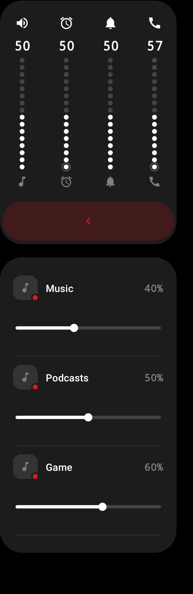
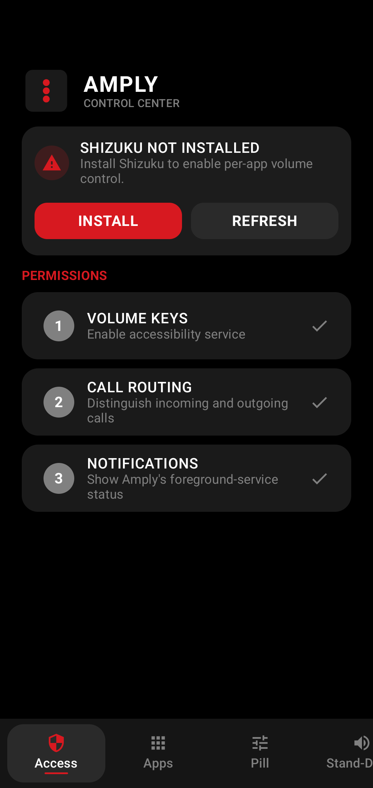
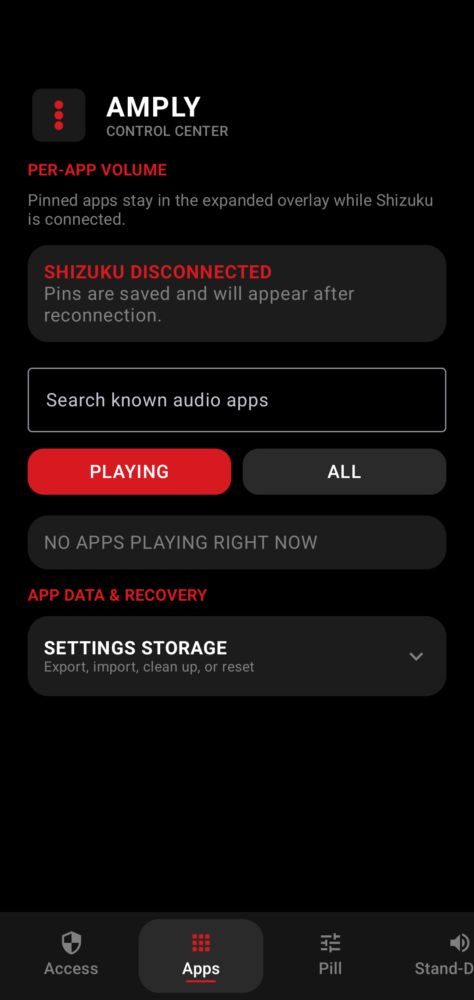
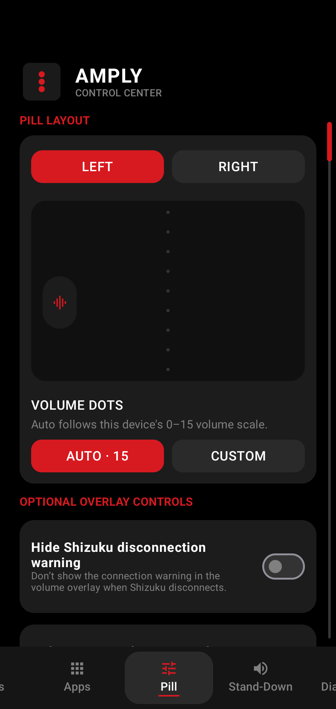
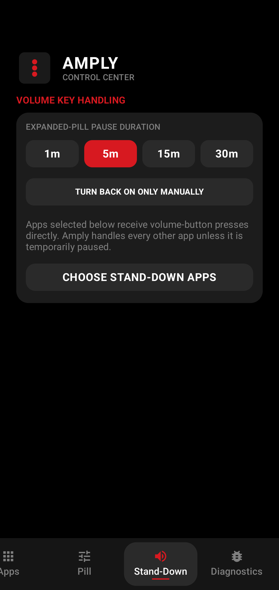

# Amply (1)

<div align="center">

**Your Android volume buttons, upgraded.**

Amply (1) replaces the stock volume popup with a clean, customizable volume pill. Expand it when you need more control: adjust every system stream, turn down individual apps, or temporarily hand control back to Android.

[](https://github.com/AgentKosticka/Amply/releases/latest)
[](https://github.com/AgentKosticka/Amply/releases)
[](LICENSE)

<br>


<sub>Captured from Amply's real Compose overlay on Android 16. Music, Podcasts, and Game are deterministic sample apps.</sub>

</div>

## What Amply gives you

- **A focused volume pill** that stays close to the edge of your screen and out of the way.
- **All your important volume controls together**—media, ring, notifications, alarms, calls, and supported optional streams.
- **Independent app volume** for active audio apps when Shizuku is connected.
- **Remembered app preferences** so favorite volumes, pinned apps, hidden apps, and display order survive between sessions.
- **Output profiles and named presets** for keeping different app, system, ringer, and Do Not Disturb levels on your speaker, headphones, Bluetooth devices, and cast routes.
- **A quick way back to Android's controls** by pausing Amply or letting selected apps receive the original volume-button behavior.
- **A Quick Settings switch** that lights up while Amply is on and dims while it is paused.
- **A look that fits your phone** with left or right placement, vertical positioning, and an adjustable dot scale.

<table>
  <tr>
    <td align="center"></td>
    <td align="center"></td>
  </tr>
  <tr>
    <td align="center"><strong>Glanceable when collapsed</strong></td>
    <td align="center"><strong>Full control when expanded</strong></td>
  </tr>
</table>

## Inside Amply

Amply keeps its controls in one focused dashboard. Check permissions, manage remembered audio apps, shape the overlay, and decide when Android should handle the volume buttons instead.

<table>
  <tr>
    <td align="center"></td>
    <td align="center"></td>
  </tr>
  <tr>
    <td align="center"><strong>Access at a glance</strong><br><sub>See what is ready and what still needs attention.</sub></td>
    <td align="center"><strong>Your audio apps</strong><br><sub>Find, pin, organize, and recover app preferences.</sub></td>
  </tr>
  <tr>
    <td align="center"></td>
    <td align="center"></td>
  </tr>
  <tr>
    <td align="center"><strong>Make the pill yours</strong><br><sub>Choose its side, dot scale, and optional controls.</sub></td>
    <td align="center"><strong>Choose when Amply steps aside</strong><br><sub>Pause it briefly or hand selected apps back to Android.</sub></td>
  </tr>
</table>

## What you need

| Requirement | What it is for |
|---|---|
| Android 10 or newer | Amply supports Android API 29+ |
| Amply Accessibility Service | Required to notice volume-button presses and display the volume panel |
| [Shizuku](https://github.com/RikkaApps/Shizuku) | Optional; unlocks live per-app volume controls |
| Notifications | Recommended for runtime status and quick pause or retry actions |
| Phone permission | Optional; helps Amply keep volume buttons behaving naturally during calls |
| Nearby Devices | Optional; improves matching between profiles and individual paired Bluetooth outputs |

Amply works as an improved controller for normal Android volume without Shizuku. Shizuku is only required for discovering active audio players and changing individual app volume.

After installing, open Android's Quick Settings editor and add the **Amply (1)** tile for one-tap pause and resume.

## Install

1. Open the [latest release](https://github.com/AgentKosticka/Amply/releases/latest).
2. Download the versioned `Amply-vX.Y.Z.apk` and its matching `.sha256` file.
3. Verify the download if you would like to confirm it arrived unchanged.
4. Install the APK and follow Amply's guided setup.
5. Enable the specific **Amply (1)** Accessibility Service when Android opens Accessibility settings.
6. Optionally install and start [Shizuku](https://github.com/RikkaApps/Shizuku) to enable per-app controls.

On some Android versions, sideloaded apps cannot enable Accessibility immediately. Open **App info → menu → Allow restricted settings**, then return to Amply and continue setup. Amply includes this guidance in the setup flow.

### Verify the APK

Linux and macOS:

```bash
sha256sum -c Amply-vX.Y.Z.apk.sha256
```

Windows PowerShell:

```powershell
Get-FileHash .\Amply-vX.Y.Z.apk -Algorithm SHA256
Get-Content .\Amply-vX.Y.Z.apk.sha256
```

The calculated hash should match the hash in the downloaded `.sha256` file.

## Why does Amply use Accessibility?

Android does not offer an ordinary permission for replacing hardware volume-button behavior. Amply uses an Accessibility Service for two narrow jobs:

- noticing volume-button presses;
- noticing foreground-app changes so Stand-Down rules can be applied.

The service cannot retrieve window content. Amply does not read screen text, type on your behalf, or inspect the contents of other apps. It also does not request Android's `SYSTEM_ALERT_WINDOW` overlay permission.

## Privacy and data

Amply is designed to keep its state on your device:

- Settings and per-app preferences are stored locally.
- Android cloud backup and device-transfer backup are disabled.
- Exporting settings is always an explicit action.
- Diagnostics exclude app labels and package names by default.
- Amply checks the public GitHub Releases API at most once every 24 hours while online so it can tell you about updates.

There is no advertising SDK or analytics SDK in the app.

## Everyday tips

### I want the normal Android panel for a while

Use Amply's pause button. You can choose how long the pause lasts or restore Amply immediately from the app or notification.

### One app should always receive the original volume keys

Add it to **Stand-Down**. This is useful for camera apps, games, accessibility tools, or anything with special volume-button shortcuts.

### An audio app does not appear in the mixer

Start playback first and check that Shizuku is connected. Some games, native audio engines, browsers, and casting implementations do not expose a controllable Android player; Amply cannot independently adjust players Android does not expose.

### Shizuku stopped after a reboot

Open Shizuku and start it again using your usual Shizuku method, then use **Retry connection** in Amply. Normal system-volume control remains available while Shizuku is disconnected.

### Amply cannot show the panel

Check the Access tab and confirm that the Amply (1) Accessibility Service is still enabled. Amply reports overlay attachment and service connection failures as recoverable states rather than silently ignoring them.

## Known limitations

- Per-app control needs Shizuku to be installed, running, granted, and connected.
- Not every audio engine exposes a player that Android allows Amply to control.
- Android does not expose the power key to ordinary accessibility key callbacks. Screenshot button combinations therefore vary by phone manufacturer and firmware.
- When call state is ambiguous, Amply favors safety and passes call-like volume gestures through to Android.
- Advanced ringer compatibility checks temporarily change ring and notification state. They require confirmation, are blocked during calls, ringing, alarms, or Do Not Disturb, and restore the captured state afterward.

## Settings backup and recovery

The Apps tab can export Amply settings to JSON and preview a file before importing it.

- **Merge** updates matching apps, keeps other local app records, and combines Stand-Down selections.
- **Replace** makes the imported file the complete app and Stand-Down configuration.

Imports are validated before anything is committed. Oversized files, malformed app identities, duplicates, unsupported schemas, invalid ranges, and non-finite values are rejected. If app settings become unreadable, Amply keeps export, repair, and reset options available.

<details>
<summary><strong>Build Amply from source</strong></summary>

### Prerequisites

- JDK 17+
- Android SDK 37
- `local.properties` pointing to your Android SDK

### Verify and build

```bash
./gradlew testDebugUnitTest lintDebug assembleDebug assembleRelease
```

For a release build that automatically advances both `versionCode` and the patch part of
`versionName`, use:

```bash
./gradlew :app:versionedRelease
```

For example, `45` / `1.2.27` is built as `46` / `1.2.28`. The two values in
`app/build.gradle.kts` are updated only after the release build succeeds. Normal debug,
test, CI, and `assembleRelease` runs never consume a version number.

Production builds target Android API 36. A build-only Android 17/API 37 compatibility build can be created with:

```bash
./gradlew assembleDebug -PamplyTargetSdk=37
```

Release signing is enabled only when all four variables are available:

- `AMPLY_KEYSTORE_PATH`
- `AMPLY_KEYSTORE_PASSWORD`
- `AMPLY_KEY_ALIAS`
- `AMPLY_KEY_PASSWORD`

The tagged-release workflow validates version and target metadata, reuses the successful CI artifact for that commit, signs and verifies the APK, and publishes the APK plus its SHA-256 file. R8 mappings remain private workflow artifacts.

### Baseline profiles and benchmarks

Generated Baseline Profiles live in `app/src/main/generated/baselineProfiles`. Regenerate them on an API 33+ physical device:

```bash
./gradlew :app:generateBaselineProfile
```

The benchmark host provides deterministic overlay states for animation measurement and documentation captures. Physical-device testing is still required for the real Accessibility, hardware-key, Shizuku, calling, and OEM-specific paths.

</details>

## License and notices

Amply is available under the [Apache License 2.0](LICENSE). Project notices are in [NOTICE](NOTICE), and packaged third-party attributions are in [`app/src/main/assets/third_party_attributions.html`](app/src/main/assets/third_party_attributions.html).
